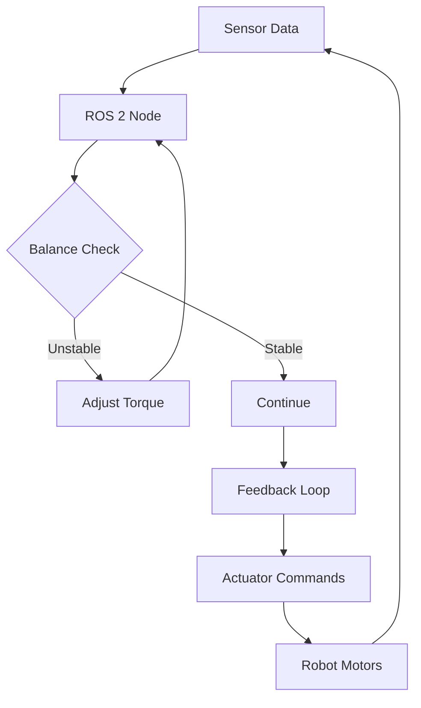

import Tabs from '@theme/Tabs';
import TabItem from '@theme/TabItem';

# Chapter 1: Nodes & Communication

## Learning Objectives
- Implement a ROS 2 node for bipedal balance control
- Distinguish between Topics, Services, and Actions
- Publish joint_torque messages using std_msgs/Float64
- Create a publisher-subscriber pattern for sensor data
- Understand ROS 2 communication patterns for humanoid robotics

## Prerequisites
- Basic Python programming knowledge
- Understanding of robotics concepts
- Familiarity with command line tools

## 1. Concept (Theory)
ROS 2 (Robot Operating System 2) provides a communication framework for robotics applications. The three main communication patterns are:
- **Topics**: Asynchronous, many-to-many communication for streaming data (e.g., sensor readings)
- **Services**: Synchronous request-response communication for configuration (e.g., mode changes)
- **Actions**: Goal-oriented communication with feedback for long-running tasks (e.g., navigation)

For humanoid robotics, Topics are most commonly used for real-time control data like joint states and sensor readings.

## 2. Simulator Implementation

<Tabs>
<TabItem value="simulation" label="Simulation Setup">

```python
import rclpy
from rclpy.node import Node
from std_msgs.msg import Float64
import math

class BipedalBalanceController(Node):
    def __init__(self):
        super().__init__('bipedal_balance_controller')

        # Create publishers for left and right hip joints
        self.left_hip_pub = self.create_publisher(Float64, '/left_hip_controller/joint_torque', 10)
        self.right_hip_pub = self.create_publisher(Float64, '/right_hip_controller/joint_torque', 10)

        # Timer for publishing at 50Hz
        self.timer = self.create_timer(0.02, self.publish_torque)
        self.get_logger().info('Bipedal Balance Controller started')

    def publish_torque(self):
        # Simple oscillating torque pattern for demonstration
        time = self.get_clock().now().nanoseconds / 1e9
        left_torque = Float64()
        left_torque.data = 0.5 * math.sin(time)

        right_torque = Float64()
        right_torque.data = 0.5 * math.sin(time + math.pi)

        self.left_hip_pub.publish(left_torque)
        self.right_hip_pub.publish(right_torque)

def main(args=None):
    rclpy.init(args=args)
    node = BipedalBalanceController()
    rclpy.spin(node)
    node.destroy_node()
    rclpy.shutdown()

if __name__ == '__main__':
    main()
```

**Hardware Reality Check**: Runs on Simulation (RTX PC)

**Dependencies**:
```xml
<!-- package.xml -->
<?xml version="1.0"?>
<?xml-model href="http://download.ros.org/schema/package_format3.xsd" schematypens="http://www.w3.org/2001/XMLSchema"?>
<package format="3">
  <name>bipedal_balance_controller</name>
  <version>0.1.0</version>
  <description>Bipedal balance controller for humanoid robots</description>
  <maintainer email="user@todo.todo">user</maintainer>
  <license>Apache-2.0</license>

  <depend>rclpy</depend>
  <depend>std_msgs</depend>

  <test_depend>ament_copyright</test_depend>
  <test_depend>ament_flake8</test_depend>
  <test_depend>ament_pep257</test_depend>
  <test_depend>python3-pytest</test_depend>

  <export>
    <build_type>ament_python</build_type>
  </export>
</package>
```

</TabItem>
</Tabs>

## 3. Edge Deployment Strategy

<Tabs>
<TabItem value="edge" label="Edge Deployment">

For edge deployment on NVIDIA Jetson platforms:

- Use the same code structure but with hardware-specific optimizations
- Implement real-time priority scheduling for control loops
- Optimize network communication for lower latency
- Consider power management constraints

**Hardware Reality Check**: Runs on Edge (Jetson)

</TabItem>
</Tabs>

## Visual Verification


## Exercises and Labs
1. Implement a simple publisher that publishes joint_torque values
2. Create a subscriber that logs received torque values
3. Modify the controller to respond to simulated IMU data
4. Add a service call to change control parameters

## Troubleshooting
- If nodes don't communicate, check ROS_DOMAIN_ID environment variable
- If torque commands have no effect, verify controller configuration
- For performance issues, ensure control loop runs at appropriate frequency

## Further Reading
- ROS 2 documentation on communication patterns
- URDF/SDF chapter for robot description
- Isaac Sim setup for simulation environment