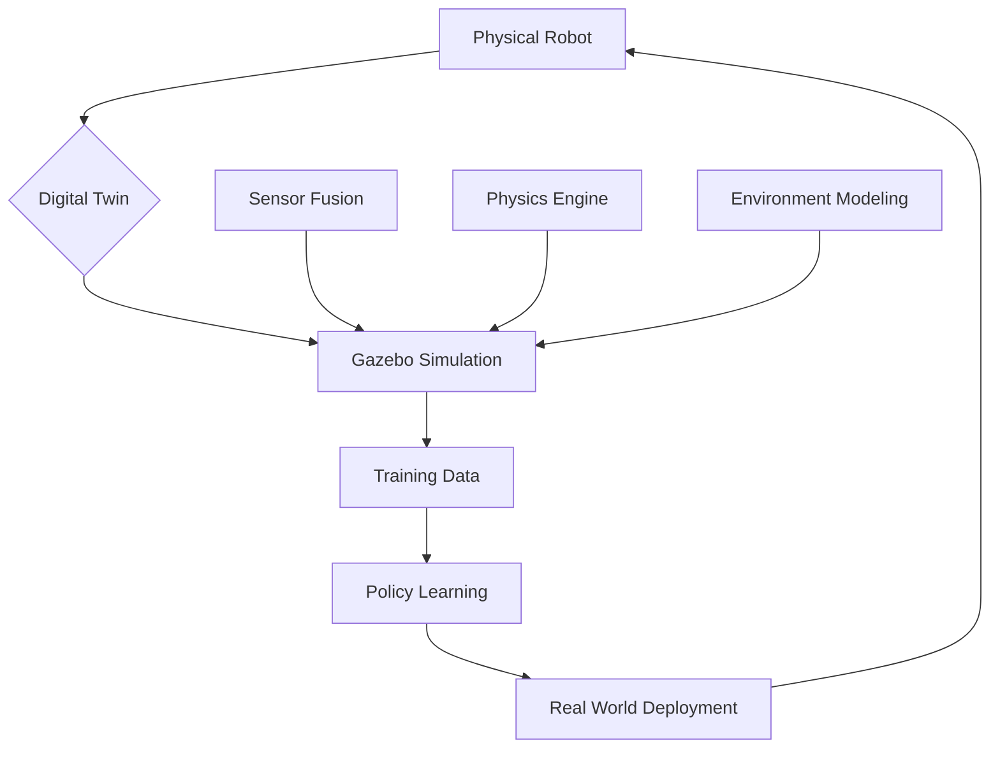

import Tabs from '@theme/Tabs';
import TabItem from '@theme/TabItem';

# Chapter 1: Gazebo Basics & Digital Twin Concepts

## Learning Objectives
- Set up Gazebo Fortress for humanoid robotics simulation
- Create a gym environment for robot training
- Configure IMU sensors with realistic noise parameters
- Implement gravity simulation for bipedal locomotion
- Understand digital twin concepts for robotics

## Prerequisites
- ROS 2 basics from Module 1
- URDF knowledge from M1C2
- Basic understanding of physics simulation

## 1. Concept (Theory)
Gazebo is a physics-based simulation environment that enables testing of robotics algorithms without physical hardware. A digital twin is a virtual replica of a physical system that can be used for testing, training, and validation. Key concepts include:
- Physics simulation with realistic dynamics
- Sensor simulation with noise models
- Environment modeling for training scenarios
- Real-time vs offline simulation trade-offs

## 2. Simulator Implementation

<Tabs>
<TabItem value="simulation" label="Simulation Setup">

```xml
<?xml version="1.0"?>
<sdf version="1.7">
  <world name="humanoid_gym">
    <!-- Include the default world -->
    <include>
      <uri>model://ground_plane</uri>
    </include>

    <include>
      <uri>model://sun</uri>
    </include>

    <!-- Create a simple gym environment -->
    <model name="balance_beam">
      <pose>2 0 0.1 0 0 0</pose>
      <link name="link">
        <collision name="collision">
          <geometry>
            <box>
              <size>4 0.1 0.1</size>
            </box>
          </geometry>
        </collision>
        <visual name="visual">
          <geometry>
            <box>
              <size>4 0.1 0.1</size>
            </box>
          </geometry>
          <material>
            <ambient>0.5 0.5 0.5 1</ambient>
            <diffuse>0.8 0.8 0.8 1</diffuse>
          </material>
        </visual>
        <inertial>
          <mass>1.0</mass>
          <inertia>
            <ixx>1</ixx>
            <ixy>0</ixy>
            <ixz>0</ixz>
            <iyy>1</iyy>
            <iyz>0</iyz>
            <izz>1</izz>
          </inertia>
        </inertial>
      </link>
    </model>

    <!-- Add an IMU sensor to a simple robot -->
    <model name="simple_robot">
      <pose>0 0 0.5 0 0 0</pose>
      <link name="base_link">
        <inertial>
          <mass>1.0</mass>
          <inertia>
            <ixx>0.1</ixx>
            <ixy>0</ixy>
            <ixz>0</ixz>
            <iyy>0.1</iyy>
            <iyz>0</iyz>
            <izz>0.1</izz>
          </inertia>
        </inertial>

        <visual name="visual">
          <geometry>
            <box>
              <size>0.2 0.2 0.2</size>
            </box>
          </geometry>
        </visual>

        <collision name="collision">
          <geometry>
            <box>
              <size>0.2 0.2 0.2</size>
            </box>
          </geometry>
        </collision>

        <!-- IMU sensor with realistic noise -->
        <sensor name="imu_sensor" type="imu">
          <pose>0 0 0 0 0 0</pose>
          <topic>imu/data</topic>
          <update_rate>100</update_rate>
          <imu>
            <angular_velocity>
              <x>
                <noise type="gaussian">
                  <mean>0.0</mean>
                  <stddev>0.001</stddev>
                </noise>
              </x>
              <y>
                <noise type="gaussian">
                  <mean>0.0</mean>
                  <stddev>0.001</stddev>
                </noise>
              </y>
              <z>
                <noise type="gaussian">
                  <mean>0.0</mean>
                  <stddev>0.001</stddev>
                </noise>
              </z>
            </angular_velocity>
            <linear_acceleration>
              <x>
                <noise type="gaussian">
                  <mean>0.0</mean>
                  <stddev>0.017</stddev>
                </noise>
              </x>
              <y>
                <noise type="gaussian">
                  <mean>0.0</mean>
                  <stddev>0.017</stddev>
                </noise>
              </y>
              <z>
                <noise type="gaussian">
                  <mean>0.0</mean>
                  <stddev>0.017</stddev>
                </noise>
              </z>
            </linear_acceleration>
          </imu>
        </sensor>
      </link>
    </model>

    <!-- Gravity settings for realistic bipedal simulation -->
    <gravity>0 0 -9.8</gravity>

    <!-- Physics engine configuration -->
    <physics name="1ms" type="ode">
      <max_step_size>0.001</max_step_size>
      <real_time_factor>1.0</real_time_factor>
      <real_time_update_rate>1000.0</real_time_update_rate>
      <ode>
        <solver>
          <type>quick</type>
          <iters>10</iters>
          <sor>1.0</sor>
        </solver>
        <constraints>
          <cfm>0.0</cfm>
          <erp>0.2</erp>
          <contact_max_correcting_vel>100.0</contact_max_correcting_vel>
          <contact_surface_layer>0.001</contact_surface_layer>
        </constraints>
      </ode>
    </physics>
  </world>
</sdf>
```

Launch the simulation:
```bash
# Launch Gazebo with the custom world
gz sim -r humanoid_gym.sdf

# Or use ROS 2 Gazebo integration
ros2 launch gazebo_ros gazebo.launch.py world:=$(pwd)/humanoid_gym.sdf
```

**Hardware Reality Check**: Runs on Simulation (RTX PC)

**Dependencies**:
```xml
<!-- package.xml -->
<?xml version="1.0"?>
<?xml-model href="http://download.ros.org/schema/package_format3.xsd" schematypens="http://www.w3.org/2001/XMLSchema"?>
<package format="3">
  <name>humanoid_gym_simulation</name>
  <version>0.1.0</version>
  <description>Gazebo world for humanoid robot training</description>
  <maintainer email="user@todo.todo">user</maintainer>
  <license>Apache-2.0</license>

  <exec_depend>gazebo_ros_pkgs</exec_depend>
  <exec_depend>gazebo_plugins</exec_depend>

  <export>
    <build_type>ament_cmake</build_type>
  </export>
</package>
```

</TabItem>
</Tabs>

## 3. Edge Deployment Strategy

<Tabs>
<TabItem value="edge" label="Edge Deployment">

For edge deployment considerations:

- Digital twin validation: Use simulation results to inform real-world robot behavior
- Transfer learning: Apply policies learned in simulation to physical robots
- Reality gap mitigation: Account for differences between simulation and reality

**Hardware Reality Check**: Digital twin concept applies to Edge (Jetson) through simulation-to-reality transfer

</TabItem>
</Tabs>

## Visual Verification


## Exercises and Labs
1. Create a Gazebo world with obstacles for navigation training
2. Add realistic IMU noise to your robot model
3. Configure physics parameters for stable bipedal simulation
4. Implement a simple balance controller in the simulated environment

## Troubleshooting
- If simulation is unstable, reduce step size or adjust physics parameters
- If IMU data is too noisy, verify noise parameters match real sensor specs
- For performance issues, simplify collision meshes or reduce update rates

## Further Reading
- Gazebo Fortress documentation
- Physics simulation best practices
- Sensor simulation for robotics