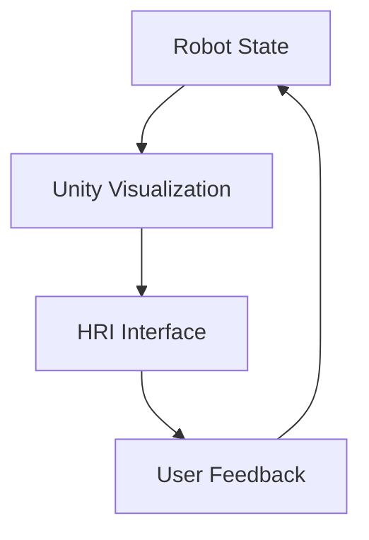

# Chapter 2: Unity Bridge for Advanced Visualization

## Overview
This chapter covers advanced visualization techniques using Unity for Human-Robot Interaction (HRI) scenarios. Unity provides high-fidelity rendering capabilities that complement the physics simulation capabilities of Gazebo.

## Learning Objectives
- Set up Unity for Human-Robot Interaction scenarios
- Create advanced visualizations for robot behavior
- Implement Unity bridge for real-time simulation
- Understand the trade-offs between physics accuracy and visual fidelity

## Prerequisites
- Gazebo experience from M2C1
- Basic understanding of 3D visualization

## Content Coming Soon
This chapter will be developed in a future iteration. The content will cover:

### 1. Concept (Theory)
- Unity as a visualization platform for robotics
- Unity-Robotics-Hub integration
- HRI visualization principles

### 2. Simulator Implementation
- Setting up Unity Robotics package
- Creating HRI visualization scenes
- Integrating with ROS 2

### 3. Edge Deployment Strategy
- Visualization considerations for real robots
- Performance optimization for real-time display

## Visual Verification

## Exercises and Labs
1. Set up Unity with robotics packages
2. Create a simple HRI visualization
3. Connect Unity to ROS 2 simulation

## Further Reading
- Unity Robotics documentation
- HRI visualization best practices
- Unity-Robotics-Hub tutorials