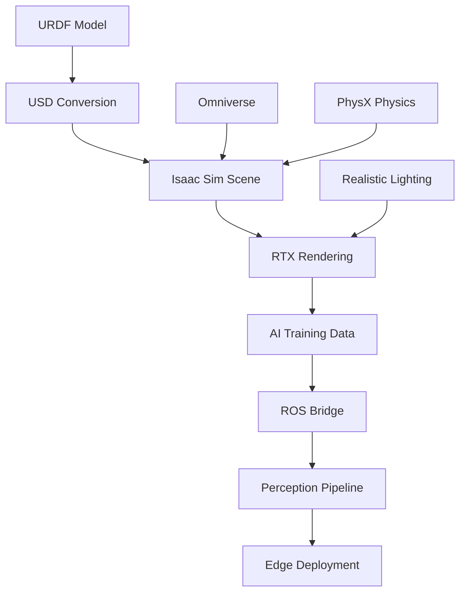

import Tabs from '@theme/Tabs';
import TabItem from '@theme/TabItem';

# Chapter 1: Isaac Sim Setup for AI Integration

## Learning Objectives
- Install and configure Isaac Sim 4.0+ for humanoid robotics
- Verify hardware requirements for RTX GPU acceleration
- Convert URDF models to USD format for Isaac Sim
- Set up Isaac ROS bridge for perception pipelines
- Configure realistic lighting and materials for AI training

## Prerequisites
- ROS 2 basics from Module 1
- Gazebo experience from M2C1
- NVIDIA RTX GPU with compatible drivers

## 1. Concept (Theory)
Isaac Sim is NVIDIA's robotics simulation platform built on the Omniverse platform. It provides:
- High-fidelity physics simulation with PhysX
- USD (Universal Scene Description) format for scene representation
- RTX-accelerated rendering for photorealistic simulation
- Integration with Isaac ROS for perception and navigation
- AI training environments with synthetic data generation

## 2. Simulator Implementation

<Tabs>
<TabItem value="simulation" label="Simulation Setup">

First, verify hardware requirements:
```bash
# Check GPU compatibility
nvidia-smi

# Isaac Sim requires:
# - NVIDIA RTX GPU (30xx/40xx series recommended)
# - Driver version 531.18 or later
# - CUDA 11.8 or later
```

Convert URDF to USD using the URDF Importer extension:
```python
# Example Python script to import and configure robot in Isaac Sim
import omni
from pxr import Usd, UsdGeom, Gf
import carb

def setup_humanoid_robot():
    # Get the USD stage
    stage = omni.usd.get_context().get_stage()

    # Import URDF (this would be done through Isaac Sim's URDF Importer GUI in practice)
    # For this example, we'll create a simple humanoid structure
    robot_path = "/World/HumanoidRobot"
    robot_prim = stage.DefinePrim(robot_path, "Xform")

    # Create basic humanoid structure
    # This is a simplified example - in practice, use the URDF Importer extension
    print("Humanoid robot setup complete")

# Run this in Isaac Sim's scripting window or as an extension
setup_humanoid_robot()
```

Create a USD stage for humanoid training:
```usda
#usda 1.0
(
    customLayerData = {
        string creator = "Isaac Sim 4.0.0"
        string title = "Humanoid Training Environment"
    }
    defaultPrim = "World"
    metersPerUnit = 1
    upAxis = "Y"
)

def Xform "World"
{
    def Xform "GroundPlane"
    {
        def Cylinder "cylinder"
        {
            matrix4d xformOp:transform = ( (100, 0, 0, 0), (0, 0.1, 0, 0), (0, 0, 100, 0), (0, 0, 0, 1) )
            custom string physics:collisionGroupName = "ground_plane"
            custom bool physics:convexDecompositionEnabled = 0
            custom bool physics:convexHullEnabled = 1
            custom bool physics:dynamicFriction = 0.5
            custom bool physics:restitution = 0.1
        }
    }

    def Xform "HumanoidRobot"
    {
        # Robot structure would be imported from URDF
        # This is where your converted robot model would appear
    }
}
```

Set up Isaac ROS bridge for perception:
```bash
# Terminal 1: Launch Isaac Sim
./isaac-sim/python.sh -c "from omni.isaac.kit import SimulationApp; config = {'headless': False}; sim_app = SimulationApp(config); sim_app.run(); sim_app.close()"

# Terminal 2: Launch ROS bridge
roslaunch isaac_ros_bridges isaac_ros_bridge.launch.py
```

**Hardware Reality Check**: Runs on Simulation (RTX PC)

**Dependencies**:
```bash
# System requirements
- NVIDIA RTX GPU (3060 or higher recommended)
- 16GB+ RAM
- 50GB+ free disk space
- Ubuntu 22.04 or Windows 10/11

# Isaac Sim installation
# Download from NVIDIA Developer website
# Requires NVIDIA Omniverse Launcher
```

</TabItem>
</Tabs>

## 3. Edge Deployment Strategy

<Tabs>
<TabItem value="edge" label="Edge Deployment">

For edge deployment considerations:

- AI model training in Isaac Sim for deployment on Jetson
- Synthetic data generation for perception pipelines
- Simulation-to-reality transfer learning
- Performance optimization for edge inference

**Hardware Reality Check**: AI models trained in Simulation (RTX PC) deployed on Edge (Jetson)

</TabItem>
</Tabs>

## Visual Verification


## Exercises and Labs
1. Install Isaac Sim and verify hardware requirements
2. Import a simple URDF robot model into Isaac Sim
3. Set up a basic USD scene with your robot
4. Configure Isaac ROS bridge for sensor data
5. Generate synthetic training data for perception tasks

## Troubleshooting
- If Isaac Sim fails to launch, verify GPU drivers and CUDA compatibility
- For rendering issues, check RTX GPU support and memory
- If ROS bridge fails, ensure ROS 2 Humble/Iron is properly installed
- For performance issues, reduce scene complexity or lighting effects

## Further Reading
- Isaac Sim 4.0+ documentation
- USD format specification
- Isaac ROS bridge tutorials
- PhysX physics simulation guide