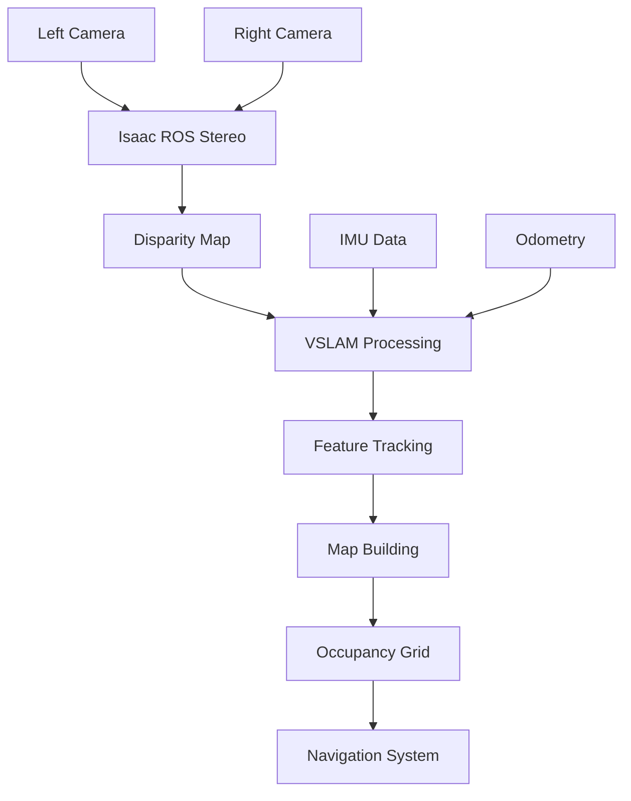

import Tabs from '@theme/Tabs';
import TabItem from '@theme/TabItem';

# Chapter 2: Isaac ROS & VSLAM for Perception Pipeline

## Learning Objectives
- Configure Isaac ROS perception packages for humanoid robots
- Set up Visual SLAM (Simultaneous Localization and Mapping) pipeline
- Implement stereo camera processing with Isaac ROS
- Create occupancy grid maps for navigation
- Integrate perception data with navigation stack

## Prerequisites
- Isaac Sim setup from M3C1
- ROS 2 communication patterns from M1C1
- Basic understanding of computer vision concepts

## 1. Concept (Theory)
Visual SLAM (Simultaneous Localization and Mapping) enables robots to build maps of unknown environments while simultaneously localizing themselves within those maps. In Isaac ROS, this involves:
- Stereo camera processing for depth estimation
- Feature extraction and tracking
- Pose estimation and map building
- Loop closure detection
- Bundle adjustment for map optimization

Isaac ROS provides optimized implementations of these algorithms for NVIDIA hardware.

## 2. Simulator Implementation

<Tabs>
<TabItem value="simulation" label="Simulation Setup">

```python
# Example ROS 2 node for Isaac ROS stereo processing
import rclpy
from rclpy.node import Node
from sensor_msgs.msg import Image
from stereo_msgs.msg import DisparityImage
from nav_msgs.msg import OccupancyGrid
import cv2
from cv_bridge import CvBridge

class IsaacVSLAMNode(Node):
    def __init__(self):
        super().__init__('isaac_vs_lam_node')

        # Create subscribers for stereo camera images
        self.left_sub = self.create_subscription(
            Image, '/camera/left/image_rect_color', self.left_image_callback, 10)
        self.right_sub = self.create_subscription(
            Image, '/camera/right/image_rect_color', self.right_image_callback, 10)

        # Create publishers for disparity and occupancy grid
        self.disparity_pub = self.create_publisher(DisparityImage, '/disparity_map', 10)
        self.occupancy_pub = self.create_publisher(OccupancyGrid, '/map', 10)

        self.bridge = CvBridge()
        self.left_image = None
        self.right_image = None

        self.get_logger().info('Isaac VSLAM node started')

    def left_image_callback(self, msg):
        self.left_image = self.bridge.imgmsg_to_cv2(msg, desired_encoding='passthrough')
        self.process_stereo()

    def right_image_callback(self, msg):
        self.right_image = self.bridge.imgmsg_to_cv2(msg, desired_encoding='passthrough')
        self.process_stereo()

    def process_stereo(self):
        if self.left_image is not None and self.right_image is not None:
            # In practice, use Isaac ROS stereo packages
            # This is a simplified example
            stereo = cv2.StereoBM_create(numDisparities=16, blockSize=15)
            disparity = stereo.compute(self.left_image, self.right_image)

            # Publish disparity map
            disparity_msg = self.bridge.cv2_to_imgmsg(disparity, encoding='mono16')
            self.disparity_pub.publish(disparity_msg)

            # Reset images to avoid repeated processing
            self.left_image = None
            self.right_image = None

def main(args=None):
    rclpy.init(args=args)
    node = IsaacVSLAMNode()
    rclpy.spin(node)
    node.destroy_node()
    rclpy.shutdown()

if __name__ == '__main__':
    main()
```

Launch file for Isaac ROS VSLAM:
```xml
<!-- vs_lam_pipeline.launch.py -->
from launch import LaunchDescription
from launch_ros.actions import Node
from ament_index_python.packages import get_package_share_directory
import os

def generate_launch_description():
    # Isaac ROS stereo image processing node
    stereo_rectify_node = Node(
        package='isaac_ros_stereo_image_proc',
        executable='isaac_ros_stereo_rectify',
        name='stereo_rectify',
        parameters=[{
            'left_namespace': '/camera/left',
            'right_namespace': '/camera/right',
            'use_system_default_qos': True
        }]
    )

    # Isaac ROS stereo node for disparity computation
    stereo_node = Node(
        package='isaac_ros_stereo_image_proc',
        executable='isaac_ros_stereo_node',
        name='stereo_node',
        parameters=[{
            'use_system_default_qos': True
        }]
    )

    # Isaac ROS VSLAM node
    vs_lam_node = Node(
        package='isaac_ros_vslam',
        executable='isaac_ros_vslam',
        name='vs_lam_node',
        parameters=[{
            'input_width': 640,
            'input_height': 480,
            'publish_map_odom_transform': True
        }]
    )

    return LaunchDescription([
        stereo_rectify_node,
        stereo_node,
        vs_lam_node
    ])
```

**Hardware Reality Check**: Runs on Simulation (RTX PC)

**Dependencies**:
```xml
<!-- package.xml -->
<?xml version="1.0"?>
<?xml-model href="http://download.ros.org/schema/package_format3.xsd" schematypens="http://www.w3.org/2001/XMLSchema"?>
<package format="3">
  <name>isaac_vs_lam_pipeline</name>
  <version>0.1.0</version>
  <description>Isaac ROS VSLAM pipeline for humanoid robots</description>
  <maintainer email="user@todo.todo">user</maintainer>
  <license>Apache-2.0</license>

  <depend>rclpy</depend>
  <depend>sensor_msgs</depend>
  <depend>stereo_msgs</depend>
  <depend>nav_msgs</depend>
  <depend>cv_bridge</depend>
  <depend>isaac_ros_stereo_image_proc</depend>
  <depend>isaac_ros_vslam</depend>

  <export>
    <build_type>ament_python</build_type>
  </export>
</package>
```

</TabItem>
</Tabs>

## 3. Edge Deployment Strategy

<Tabs>
<TabItem value="edge" label="Edge Deployment">

Deploy VSLAM pipeline on NVIDIA Jetson:

```bash
# Launch VSLAM pipeline optimized for Jetson
# Use Jetson-specific Isaac ROS packages
ros2 launch isaac_ros_vslam_jetson vs_lam_pipeline_jetson.launch.py

# Monitor resource usage
sudo tegrastats  # For Jetson-specific monitoring
```

Optimize for edge constraints:
- Reduce image resolution for faster processing
- Use Jetson-optimized inference models
- Implement dynamic reconfiguration for performance

**Hardware Reality Check**: Runs on Edge (Jetson)

</TabItem>
</Tabs>

## Visual Verification


## Exercises and Labs
1. Set up Isaac ROS stereo processing pipeline in simulation
2. Configure VSLAM for your humanoid robot model
3. Generate occupancy grid maps of simulated environments
4. Test VSLAM performance with different lighting conditions
5. Deploy a simplified version on Jetson hardware

## Troubleshooting
- If stereo processing fails, verify camera calibration parameters
- For VSLAM drift, check IMU integration and loop closure settings
- For performance issues, reduce image resolution or processing frequency
- If maps are inconsistent, verify time synchronization between sensors

## Further Reading
- Isaac ROS perception packages documentation
- VSLAM algorithms overview
- Stereo vision in robotics
- Occupancy grid mapping techniques