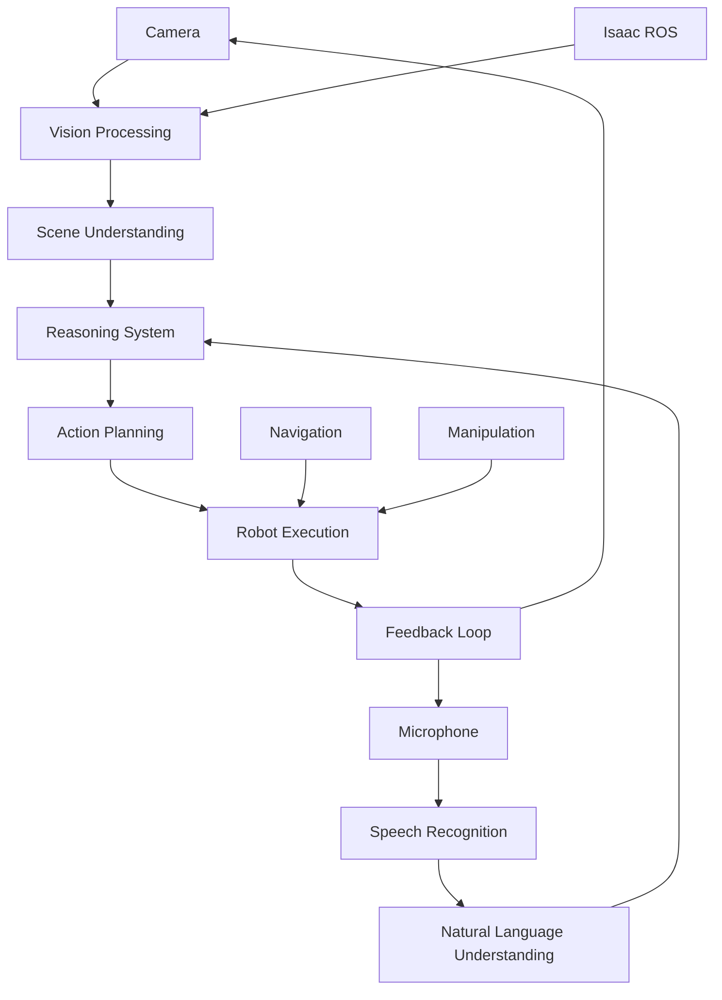

import Tabs from '@theme/Tabs';
import TabItem from '@theme/TabItem';

# Chapter 2: VLA Pipeline - Vision-Language-Action Capstone

## Learning Objectives
- Integrate vision, language, and action systems into a unified pipeline
- Implement the "Clean Up Task" capstone project
- Create multimodal perception for object recognition
- Develop reasoning systems that combine vision and language
- Deploy complete VLA pipeline on humanoid robot

## Prerequisites
- Voice-to-Action system from M4C1
- Navigation from M3C3
- Perception pipeline from M3C2
- Isaac Sim experience from M3C1

## 1. Concept (Theory)
Vision-Language-Action (VLA) systems represent the integration of perception, reasoning, and action in robotics. The complete pipeline includes:
- Vision processing for environment understanding
- Language processing for command interpretation
- Action planning and execution
- Closed-loop feedback and adaptation

The "Clean Up Task" capstone demonstrates all modules working together: the robot receives a voice command to clean up objects, uses vision to identify and locate objects, plans navigation paths, and executes manipulation actions.

## 2. Simulator Implementation

<Tabs>
<TabItem value="simulation" label="Simulation Setup">

```python
# vla_pipeline_node.py
import rclpy
from rclpy.node import Node
from std_msgs.msg import String
from sensor_msgs.msg import Image, CameraInfo
from geometry_msgs.msg import Pose, Point
from vision_msgs.msg import Detection2DArray, ObjectHypothesisWithPose
import cv2
from cv_bridge import CvBridge
import openai
import threading
import queue
import time
import json
from typing import List, Dict, Any

class VLAPipelineNode(Node):
    def __init__(self):
        super().__init__('vla_pipeline_node')

        # Initialize components
        self.cv_bridge = CvBridge()
        self.openai_client = openai.OpenAI()

        # Subscribers
        self.image_sub = self.create_subscription(
            Image, '/camera/rgb/image_raw', self.image_callback, 10)
        self.voice_cmd_sub = self.create_subscription(
            String, 'voice_commands', self.voice_command_callback, 10)

        # Publishers
        self.status_pub = self.create_publisher(String, 'vla_status', 10)
        self.action_pub = self.create_publisher(String, 'robot_actions', 10)

        # Internal state
        self.current_image = None
        self.command_queue = queue.Queue()
        self.is_processing = False

        # Start processing thread
        self.processing_thread = threading.Thread(target=self.process_commands_loop)
        self.processing_thread.daemon = True
        self.processing_thread.start()

        self.get_logger().info('VLA Pipeline node started')

    def image_callback(self, msg):
        """Store latest camera image"""
        try:
            self.current_image = self.cv_bridge.imgmsg_to_cv2(msg, desired_encoding='bgr8')
        except Exception as e:
            self.get_logger().error(f'Image conversion error: {e}')

    def voice_command_callback(self, msg):
        """Queue voice command for processing"""
        if not self.is_processing:
            self.command_queue.put(msg.data)
            self.get_logger().info(f'Queued command: {msg.data}')

    def process_commands_loop(self):
        """Process commands in separate thread"""
        while rclpy.ok():
            try:
                command = self.command_queue.get(timeout=1.0)
                self.is_processing = True
                self.process_vla_command(command)
                self.is_processing = False
            except queue.Empty:
                continue
            except Exception as e:
                self.get_logger().error(f'Command processing error: {e}')
                self.is_processing = False

    def process_vla_command(self, command_text):
        """Process vision-language-action command"""
        try:
            self.get_logger().info(f'Processing VLA command: {command_text}')

            # Publish status
            status_msg = String()
            status_msg.data = f'Processing: {command_text}'
            self.status_pub.publish(status_msg)

            # If we have an image, analyze it
            if self.current_image is not None:
                # Perform object detection (in simulation, we'll simulate this)
                objects = self.detect_objects_in_image(self.current_image, command_text)

                # Use OpenAI to reason about the scene and command
                action_plan = self.reason_about_command_and_scene(command_text, objects)

                # Execute the action plan
                self.execute_action_plan(action_plan)
            else:
                self.get_logger().warn('No image available for VLA processing')

        except Exception as e:
            self.get_logger().error(f'VLA processing error: {e}')
            # Publish error status
            status_msg = String()
            status_msg.data = f'Error: {str(e)}'
            self.status_pub.publish(status_msg)

    def detect_objects_in_image(self, image, command_text):
        """Simulate object detection in image (in simulation)"""
        # In a real system, this would use Isaac ROS perception packages
        # For simulation, we'll create mock detections based on command
        if 'clean up' in command_text.lower() or 'pick up' in command_text.lower():
            # Simulate detecting objects that need to be cleaned up
            objects = [
                {
                    "name": "toy_block",
                    "confidence": 0.9,
                    "bbox": [100, 100, 200, 200],  # x, y, width, height
                    "position": [0.5, 0.3, 0.0]  # x, y, z in robot frame
                },
                {
                    "name": "ball",
                    "confidence": 0.85,
                    "bbox": [300, 200, 150, 150],
                    "position": [0.8, -0.2, 0.0]
                }
            ]
        else:
            objects = []

        return objects

    def reason_about_command_and_scene(self, command_text, objects):
        """Use LLM to reason about command and scene to create action plan"""
        try:
            # Create context for the LLM
            context = f"""
            User command: {command_text}

            Detected objects in scene:
            {json.dumps(objects, indent=2)}

            Create a step-by-step action plan for a humanoid robot to execute the command.
            The robot has navigation, manipulation, and speech capabilities.
            Return JSON with:
            {{
              "actions": [
                {{
                  "type": "navigate"|"pick_up"|"place"|"speak"|"other",
                  "parameters": {{...}},
                  "description": "Human-readable description"
                }}
              ]
            }}
            """

            response = self.openai_client.chat.completions.create(
                model="gpt-3.5-turbo",
                messages=[
                    {
                        "role": "system",
                        "content": "You are a reasoning system for a humanoid robot. Create action plans based on user commands and scene understanding."
                    },
                    {
                        "role": "user",
                        "content": context
                    }
                ],
                temperature=0.1
            )

            # Parse the action plan
            result = json.loads(response.choices[0].message.content)
            return result.get('actions', [])

        except Exception as e:
            self.get_logger().error(f'Reasoning error: {e}')
            # Return a simple default plan
            return [
                {
                    "type": "speak",
                    "parameters": {"text": "I'm not sure how to do that."},
                    "description": "Express uncertainty"
                }
            ]

    def execute_action_plan(self, action_plan):
        """Execute the action plan step by step"""
        for action in action_plan:
            action_type = action.get('type')
            parameters = action.get('parameters', {})
            description = action.get('description', '')

            self.get_logger().info(f'Executing: {description}')

            if action_type == 'navigate':
                self.execute_navigation_action(parameters)
            elif action_type == 'pick_up':
                self.execute_pickup_action(parameters)
            elif action_type == 'place':
                self.execute_place_action(parameters)
            elif action_type == 'speak':
                self.execute_speak_action(parameters)
            else:
                self.get_logger().warn(f'Unknown action type: {action_type}')

            # Publish action
            action_msg = String()
            action_msg.data = json.dumps(action)
            self.action_pub.publish(action_msg)

            time.sleep(1)  # Simulate action execution time

    def execute_navigation_action(self, params):
        """Execute navigation action"""
        # This would interface with Nav2
        self.get_logger().info(f'Navigating to: {params}')

    def execute_pickup_action(self, params):
        """Execute pickup action"""
        # This would interface with manipulation system
        self.get_logger().info(f'Picking up: {params}')

    def execute_place_action(self, params):
        """Execute place action"""
        # This would interface with manipulation system
        self.get_logger().info(f'Placing at: {params}')

    def execute_speak_action(self, params):
        """Execute speech action"""
        text = params.get('text', 'Hello')
        self.get_logger().info(f'Speaking: {text}')

def main(args=None):
    rclpy.init(args=args)
    node = VLAPipelineNode()

    try:
        rclpy.spin(node)
    except KeyboardInterrupt:
        pass
    finally:
        node.destroy_node()
        rclpy.shutdown()

if __name__ == '__main__':
    main()
```

Launch file for complete VLA pipeline:
```xml
<!-- vla_pipeline.launch.py -->
from launch import LaunchDescription
from launch_ros.actions import Node
from ament_index_python.packages import get_package_share_directory
import os

def generate_launch_description():
    # VLA pipeline node
    vla_node = Node(
        package='vla_pipeline',
        executable='vla_pipeline_node',
        name='vla_pipeline',
        parameters=[{
            'use_sim_time': True
        }],
        remappings=[
            ('/camera/rgb/image_raw', '/head_camera/rgb/image_raw'),
            ('/camera/depth/image_raw', '/head_camera/depth/image_raw')
        ]
    )

    # Voice-to-action node
    voice_node = Node(
        package='voice_to_action',
        executable='voice_to_action_node',
        name='voice_to_action',
        parameters=[{
            'use_sim_time': True
        }]
    )

    # Navigation system
    nav_node = Node(
        package='nav2_lifecycle_manager',
        executable='lifecycle_manager',
        name='lifecycle_manager',
        parameters=[{
            'use_sim_time': True,
            'autostart': True,
            'node_names': ['map_server', 'planner_server', 'controller_server', 'bt_navigator', 'amcl']
        }]
    )

    return LaunchDescription([
        vla_node,
        voice_node,
        nav_node
    ])
```

**Hardware Reality Check**: Runs on Simulation (RTX PC)

**Dependencies**:
```xml
<!-- package.xml -->
<?xml version="1.0"?>
<?xml-model href="http://download.ros.org/schema/package_format3.xsd" schematypens="http://www.w3.org/2001/XMLSchema"?>
<package format="3">
  <name>vla_pipeline</name>
  <version>0.1.0</version>
  <description>Vision-Language-Action pipeline for humanoid robots</description>
  <maintainer email="user@todo.todo">user</maintainer>
  <license>Apache-2.0</license>

  <depend>rclpy</depend>
  <depend>std_msgs</depend>
  <depend>sensor_msgs</depend>
  <depend>geometry_msgs</depend>
  <depend>vision_msgs</depend>
  <depend>cv_bridge</depend>
  <depend>nav2_msgs</depend>

  <exec_depend>opencv-python</exec_depend>
  <exec_depend>openai</exec_depend>
  <exec_depend>numpy</exec_depend>
  <exec_depend>pyyaml</exec_depend>

  <export>
    <build_type>ament_python</build_type>
  </export>
</package>
```

</TabItem>
</Tabs>

## 3. Edge Deployment Strategy

<Tabs>
<TabItem value="edge" label="Edge Deployment">

Deploy complete VLA pipeline on NVIDIA Jetson:

```bash
# Launch complete VLA pipeline optimized for Jetson
# Use Jetson-specific perception and reasoning models
ros2 launch vla_pipeline vla_pipeline_jetson.launch.py

# Monitor system resources
sudo tegrastats &  # Monitor Jetson-specific stats
```

Optimize for edge constraints:
- Use Jetson-optimized perception models
- Implement dynamic batching for inference
- Add power management for extended operation
- Use edge-optimized reasoning models when available

**Hardware Reality Check**: Runs on Edge (Jetson)

</TabItem>
</Tabs>

## Visual Verification


## Exercises and Labs
1. Integrate all modules into complete VLA pipeline in simulation
2. Implement the "Clean Up Task" capstone project
3. Test multimodal interaction scenarios
4. Optimize pipeline performance for real-time operation
5. Deploy complete system on Jetson hardware

## Troubleshooting
- If VLA pipeline is slow, optimize inference and processing frequency
- For integration issues, verify message types and timing
- If reasoning fails, check LLM connectivity and prompts
- For real-time issues, implement priority scheduling

## Further Reading
- VLA research papers and implementations
- Multimodal machine learning for robotics
- Real-time robotics systems design
- Human-robot interaction best practices