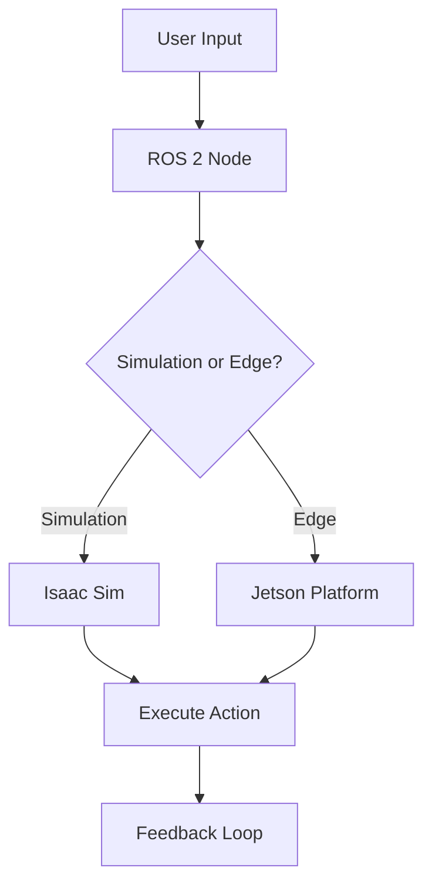

# Chapter Content Contract: Physical AI & Humanoid Robotics Book

## Contract Overview

This contract defines the interface and requirements for chapter content in the Physical AI & Humanoid Robotics book. All chapters must adhere to these specifications to ensure consistency, quality, and educational effectiveness.

## Content Interface Requirements

### Required Fields
```yaml
chapter_id: string              # Format: M{module}C{chapter} (e.g., M1C1, M2C3)
title: string                   # Chapter title
module: integer                 # Module number (1-4)
week: integer                   # Course week assignment
complexity: string              # "overview" | "medium" | "deep-technical"
target_hardware: string         # "simulation" | "edge" | "both"
learning_objectives: [string]   # List of specific, measurable objectives
prerequisites: [string]         # Required knowledge/skills
```

### Content Structure Contract
Each chapter must include these sections in the specified order:

```yaml
content_structure: {
  concept: {
    title: string,
    content: markdown,
    diagrams: [mermaid_specification]
  },
  simulator_implementation: {
    title: string,
    content: markdown,
    code_examples: [code_block],
    dependencies: dependency_specification,
    hardware_check: "Runs on Simulation (RTX PC)"
  },
  edge_deployment_strategy: {
    title: string,
    content: markdown,
    code_modifications: [code_block],
    hardware_check: "Runs on Edge (Jetson)"
  }
}
```

## Code Example Contract

### Required Code Example Format
```yaml
code_example: {
  language: "python" | "cpp" | "bash" | "xml",
  title: string,
  description: string,
  code: string,
  dependencies: {
    package_xml: string,           # For ROS 2 packages
    requirements: [string],        # For Python dependencies
    system_packages: [string]      # For system dependencies
  },
  execution_instructions: string,
  expected_output: string
}
```

### Code Validation Requirements
- All code must be syntactically correct for the specified language
- Dependencies must be complete and resolvable
- Code examples must be executable in specified environment
- Error handling must be demonstrated where appropriate

## Hardware Reality Check Contract

### Mandatory Hardware Specifications
Each tutorial must explicitly include one of these statements:
- "Runs on Simulation (RTX PC)" - for simulation-only content
- "Runs on Edge (Jetson)" - for physical robot deployment
- Both statements - for content that covers both scenarios

### Hardware Requirements Format
```yaml
hardware_requirements: {
  simulation: {
    platform: "rtx-pc",
    minimum_specs: {
      gpu: "nvidia-rtx-3060" | "higher",
      ram: "16gb" | "higher",
      cpu: "8-cores" | "higher"
    },
    software: ["ros-2-humble", "isaac-sim-4.0", "gazebo-fortress"]
  },
  edge: {
    platform: "jetson",
    device: "jetson-agx-orin" | "jetson-orin-nx" | "other-supported",
    constraints: [string],
    special_instructions: [string]
  }
}
```

## Visual Verification Contract

### Diagram Requirements
Each chapter dealing with complex concepts must include Mermaid.js diagrams:

```yaml
diagrams: [
  {
    type: "flowchart" | "sequence" | "class" | "state" | "gantt",
    title: string,
    specification: mermaid_syntax,
    description: string,
    educational_purpose: string
  }
]
```

### Example Mermaid Specification


## Educational Contract

### Learning Objective Format
Learning objectives must follow the SMART criteria:
- Specific: Clear and unambiguous
- Measurable: Observable and testable
- Achievable: Within scope of chapter
- Relevant: Connected to module goals
- Time-bound: Achievable within chapter timeframe

### Example Format
```yaml
learning_objectives: [
  "Students will be able to implement a basic ROS 2 node that publishes joint_torque messages",
  "Students will be able to configure a URDF file for a 2-DOF leg structure",
  "Students will be able to visualize their robot in rviz2"
]
```

## Quality Assurance Contract

### Content Review Checklist
- [ ] All code examples are syntactically correct
- [ ] Dependencies are properly specified
- [ ] Hardware reality checks are explicitly stated
- [ ] Mermaid.js diagrams are included for complex concepts
- [ ] Content follows pedagogical arc: Concept → Simulator → Edge
- [ ] No hallucinations - only documented APIs used
- [ ] Docusaurus MDX v3 format compliance
- [ ] Accessibility requirements met (alt text, proper headings)

### Acceptance Criteria
- Chapter builds without errors in Docusaurus environment
- All code examples execute successfully in specified environment
- Students can complete all exercises and labs
- Content passes technical accuracy review
- Pedagogical effectiveness validated by pilot testing

## Version Compatibility Contract

### Supported Versions
- ROS 2: Humble Hawksbill (LTS) and Iron Irwini only
- Isaac Sim: Version 4.0 and higher only
- Docusaurus: Version 3.x only
- Python: 3.8 and higher only

### Deprecation Policy
- Deprecated APIs are not allowed
- Experimental features must be clearly marked
- Version-specific code paths are documented
- Migration paths are provided for version changes

## Performance Contract

### Content Performance Requirements
- Page load time: <3 seconds
- Code execution time: <30 seconds for examples
- Simulation startup time: <60 seconds for basic examples
- No performance degradation in Docusaurus site

## Compliance Verification

### Automated Checks
1. Code syntax validation for all programming languages
2. Dependency resolution verification
3. Link validation for all external references
4. Image accessibility check (alt text validation)

### Manual Review Requirements
1. Technical accuracy verification by domain expert
2. Educational effectiveness validation
3. Hardware deployment verification
4. Cross-platform compatibility testing