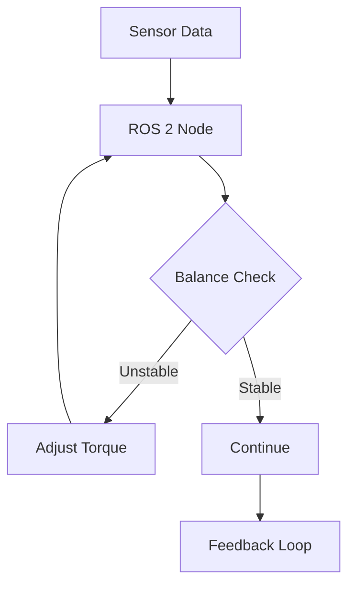

# Quickstart Guide: Physical AI & Humanoid Robotics Book Development

## Overview

This quickstart guide provides the essential steps to begin developing content for the Physical AI & Humanoid Robotics book. Follow these steps to set up your environment and create your first chapter following the established patterns and standards.

## Prerequisites

### System Requirements
- **Operating System**: Linux (Ubuntu 22.04 LTS recommended) or Windows 10/11 with WSL2
- **RAM**: 16GB minimum, 32GB recommended
- **Storage**: 50GB free space minimum
- **GPU**: NVIDIA RTX series (for Isaac Sim) or equivalent
- **CPU**: Multi-core processor (8+ cores recommended)

### Software Requirements
- **ROS 2**: Humble Hawksbill (LTS) or Iron Irwini
- **Isaac Sim**: Version 4.0 or higher
- **Gazebo Fortress**: Latest stable version
- **Node.js**: Version 18.x or higher
- **Python**: Version 3.8 or higher
- **Docusaurus CLI**: Latest v3.x version

## Environment Setup

### 1. Install ROS 2
```bash
# For Ubuntu/Debian
sudo apt update && sudo apt install curl gnupg lsb-release
curl -sSL https://raw.githubusercontent.com/ros/rosdistro/master/rosInstall.sh | sudo bash
sudo apt install ros-humble-desktop
source /opt/ros/humble/setup.bash
```

### 2. Install Isaac Sim
```bash
# Download and install Omniverse Launcher
# Install Isaac Sim 4.0+ through the launcher
# Verify installation with:
python -c "import omni; print('Isaac Sim ready')"
```

### 3. Set up Docusaurus Development
```bash
# Install Node.js dependencies
npm install
npm install @docusaurus/core@latest @docusaurus/preset-classic@latest

# Install additional dependencies for MDX v3
npm install @docusaurus/module-type-aliases @docusaurus/types
```

### 4. Clone and Configure Repository
```bash
git clone [repository-url]
cd hackathon-humanoid-robotics-course-book
git checkout -b feature/new-chapter
npm install
```

## Creating Your First Chapter

### 1. Follow the Chapter Template
Create a new MDX file in the appropriate module directory following the established template:

```md
---
id: M1C1
title: "Chapter 1: Nodes & Communication"
sidebar_label: Nodes & Communication
description: "Learn ROS 2 node communication patterns for humanoid robotics"
keywords:
  - ros2
  - nodes
  - communication
  - humanoid
module: 1
week: 1
complexity: deep-technical
target_hardware: ["simulation", "edge"]
learning_objectives:
  - "Implement a ROS 2 node for bipedal balance control"
  - "Distinguish between Topics, Services, and Actions"
  - "Publish joint_torque messages using std_msgs/Float64"
---

# Chapter 1: Nodes & Communication

## Learning Objectives
- Understand ROS 2 communication patterns
- Implement a bipedal balance controller node
- Use proper message types for robot control

## Prerequisites
- Basic Python programming knowledge
- Understanding of ROS 2 concepts

## 1. Concept (Theory)

### ROS 2 Communication Patterns
ROS 2 provides three main communication patterns...

## 2. Simulator Implementation

<Tabs>
<TabItem value="simulation" label="Simulation Setup">

```python
import rclpy
from rclpy.node import Node
from std_msgs.msg import Float64

class BipedalBalanceController(Node):
    def __init__(self):
        super().__init__('bipedal_balance_controller')
        self.publisher = self.create_publisher(Float64, 'joint_torque', 10)
        # Implementation details...
```

**Hardware Reality Check**: Runs on Simulation (RTX PC)

**Dependencies**:
```xml
<!-- package.xml -->
<package format="3">
  <name>bipedal_balance_controller</name>
  <version>0.1.0</version>
  <description>Bipedal balance controller for humanoid robots</description>
  <depend>rclpy</depend>
  <depend>std_msgs</depend>
</package>
```

</TabItem>
</Tabs>

## 3. Edge Deployment Strategy

<Tabs>
<TabItem value="edge" label="Edge Deployment">

[Edge-specific implementation details...]

**Hardware Reality Check**: Runs on Edge (Jetson)

</TabItem>
</Tabs>

## Visual Verification



## Exercises

1. Implement a simple publisher that publishes joint_torque values
2. Create a subscriber that logs received torque values
3. Deploy the node on the simulation environment

## Troubleshooting

- If Isaac Sim fails to launch, verify GPU drivers are up to date
- If ROS 2 nodes don't communicate, check ROS_DOMAIN_ID
- For performance issues, reduce simulation complexity
```

### 2. Chapter Development Workflow

1. **Create the chapter spec** following the per-chapter template
2. **Implement the content** with executable code examples
3. **Validate hardware requirements** for simulation and edge deployment
4. **Add visual verification** with Mermaid.js diagrams
5. **Test the examples** in both simulation and edge environments
6. **Review for compliance** with the content contract

### 3. Content Standards

#### Code Examples
- All code must be syntactically correct
- Include proper dependency specifications
- Provide clear execution instructions
- Demonstrate error handling where appropriate

#### Hardware Reality Checks
- Explicitly state "Runs on Simulation (RTX PC)" or "Runs on Edge (Jetson)"
- Include specific hardware requirements
- Document any platform-specific differences

#### Visual Verification
- Include Mermaid.js diagrams for complex concepts
- Use appropriate diagram types (flowchart, sequence, state, etc.)
- Provide clear descriptions of what each diagram represents

## Testing Your Chapter

### 1. Build Validation
```bash
npm run build
# Verify no build errors occur
```

### 2. Code Execution
- Test all code examples in specified environment
- Verify dependencies can be resolved
- Confirm expected outputs match documentation

### 3. Cross-Platform Verification
- Test on both simulation and edge environments where applicable
- Verify hardware requirements are accurate
- Confirm deployment instructions work as documented

## Quality Assurance Checklist

Before submitting your chapter, ensure:

- [ ] All code examples execute successfully
- [ ] Dependencies are properly documented
- [ ] Hardware reality checks are explicitly stated
- [ ] Mermaid.js diagrams are included for complex concepts
- [ ] Content follows pedagogical arc: Concept → Simulator → Edge
- [ ] No hallucinations - only documented APIs used
- [ ] Docusaurus MDX v3 format compliance
- [ ] Accessibility requirements met
- [ ] Learning objectives are specific and measurable
- [ ] Exercises are achievable and educational

## Next Steps

1. Review your chapter against the [Chapter Content Contract](./contracts/chapter-content-contract.md)
2. Test your chapter in the development environment
3. Submit your chapter for technical review
4. Prepare for integration into the main documentation site